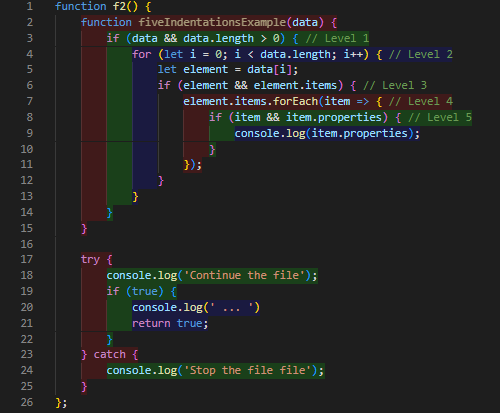
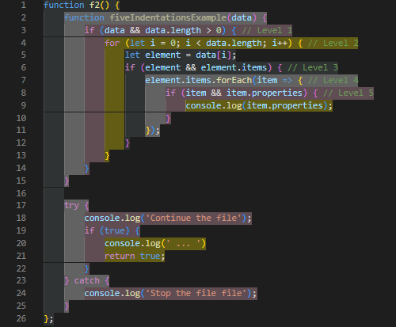
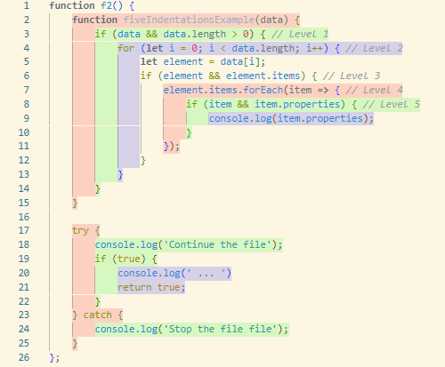
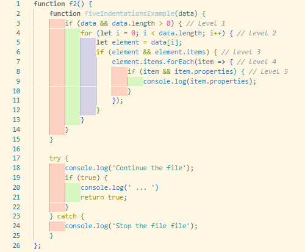
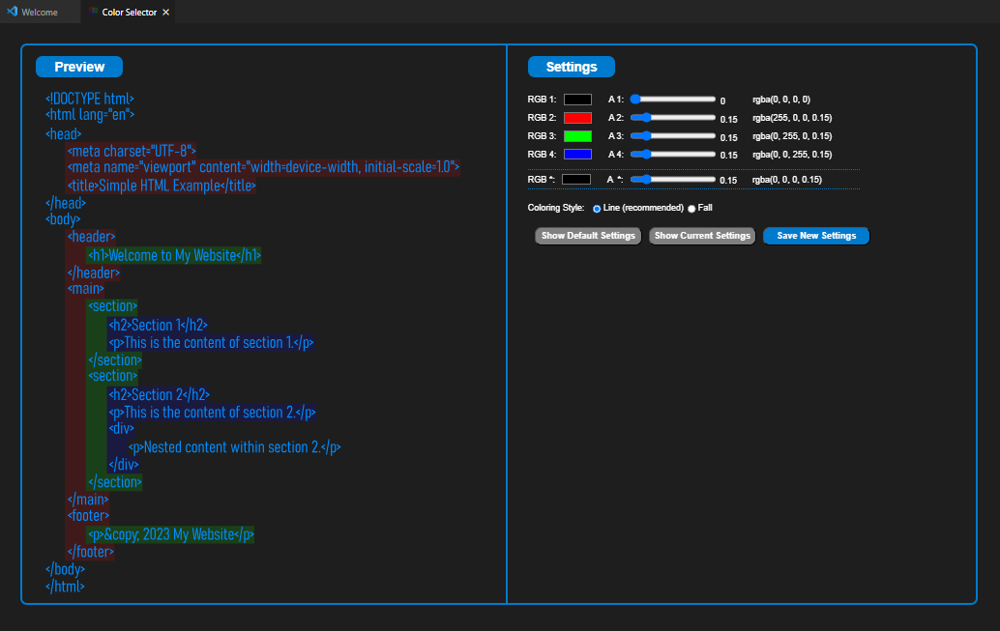
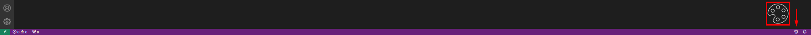

#  indent-rainbow-blocks README

"indent-rainbow-blocks" is a Visual Studio Code extension that adds a colorful background to the indentation blocks in your code. This feature allows you to quickly visualize and navigate your code structure.

## Features

- **Colorful Indentation Blocks:** Adds a rainbow of colors to your code's indentation. The colors change with each level of indentation, making it easy to distinguish between different levels.

- **Customization:** Change the colors used for indentation blocks and the style according to your preferences.
  - Coloring example (default and custom):

    
    
  
  - Style example (line and fall):

    
    
  
  <br>
  
        Note: Explore different color combinations effortlessly using the built-in color palette tool!

- **Color palettes:** Quickly modify and apply your favorite colors using the intuitive color palettes feature. Create and adjust palettes with the new tool that you can open at the button 🎨 in the lower right corner (status bar). Save your custom settings instantly for a seamless color customization experience.

  
  

  <br>
  
- **P/M languages supported:** As long as the typing involves indentation, the extension will be compatible. This includes HTML, CSS, Javascript, Python, GoLang (Go), JSON, among others.

## Requirements

- Visual Studio Code

## Extension Settings

This extension contributes the following settings:

* `indentRainbowBlocks.colors`: An array of RGBA color strings that define the colors used for indentation blocks.
```json
  "indentRainbowBlocks.colors": [
      "rgba(0, 0, 0, 0)",
      "rgba(255, 0, 0, 0.15)",
      "rgba(0, 255, 0, 0.15)",
      "rgba(0, 0, 255, 0.15)"
  ],
```
* `indentRainbowBlocks.style`: Determines the coloring style, either 'line' for full line background color or 'fall' for coloring only the indentation.
```json
  "indentRainbowBlocks.style": "line"
```


## Known Issues

None at the moment. Please report any issues you find on the GitHub repository.

## Release Notes

### 0.0.3

- Added Color Palettes Tool: A tool designed to create, test, view, update and save any color palette you can imagine through an intuitive interface. Access the tool by simply clicking on the color palette symbol in the bottom right corner of the VS Code screen (status bar).

- Fix: Recognition of color and style changes in settings without needing to reload VS Code.

### 0.0.2

- Enhanced coloring: Indentations and text are now colored based on the active indent formatter (tab or space).

- Added Dynamic Indentation Detection: Recognizes changes made either in the settings or via the status bar in real time.

### 0.0.1

- Initial release of "indent-rainbow-blocks". It includes color and style customizations.

---
